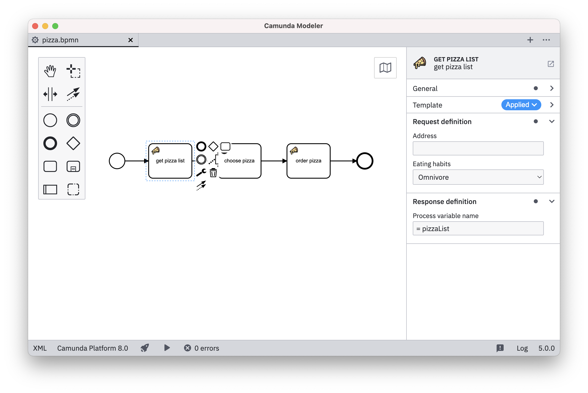
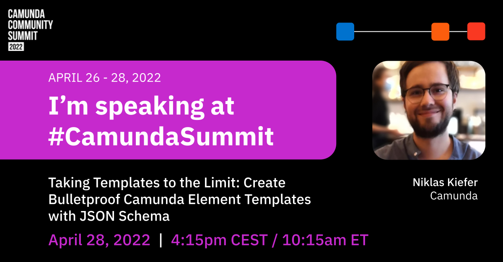

# ccs2022-resources

Resources and examples from the talk ["Taking Templates to the Limit"](https://speakerdeck.com/pinussilvestrus/taking-templates-to-the-limit) at Camunda Community Summit 2022 (28th April).

## Resources 

Find the resources of the talk

* [Slides](./resources/slides.pdf)
* [Pizza Party Element Templates](./resources/pizza-party.json)
* Recording (*to follow*)

On top, some general resources about Camunda Element Templates

* [Element Templates Documentation](https://docs.camunda.io/docs/components/modeler/desktop-modeler/element-templates/about-templates/)
* [Element Templates JSON Schema](https://github.com/camunda/element-templates-json-schema)
* [Element Templates Samples](https://github.com/camunda/camunda-modeler/tree/develop/resources/element-templates)

## Social Media

